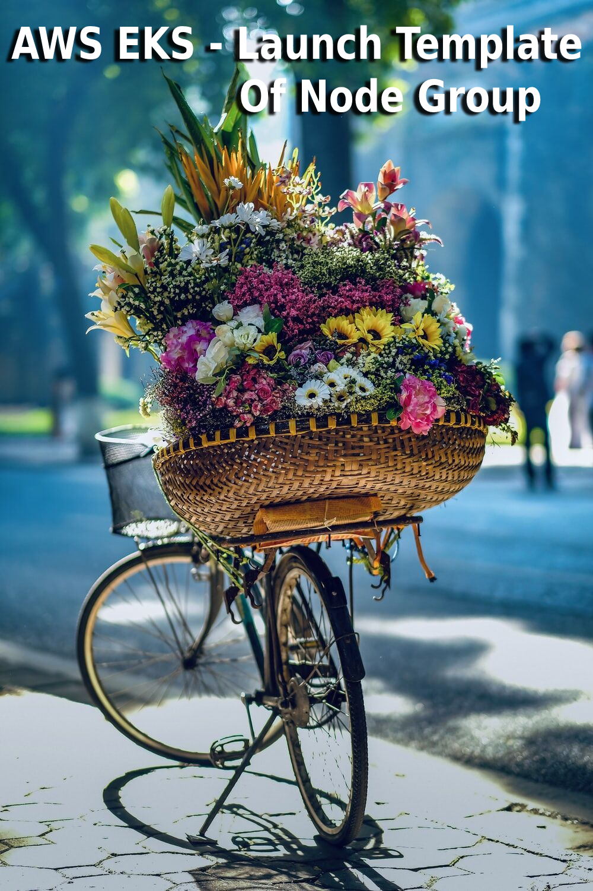
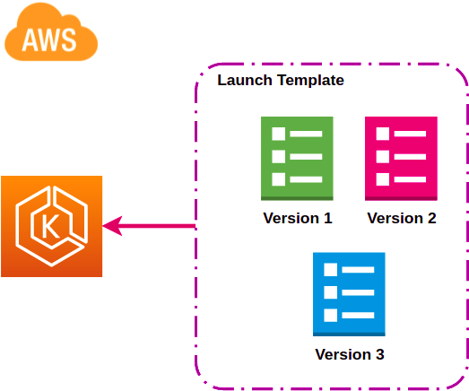

<p align="center">
  <a href="https://dev.to/vumdao">
    
  </a>
</p>
<h1 align="center">
  <div><b>AWS EKS - Launch Template Of Node Group</b></div>
</h1>

## Abstract
- Managed node groups are always deployed with an Amazon EC2 Auto Scaling Group launch template. If you don't specify your own launch template to use when creating a managed node group, the Amazon EKS API creates a launch template with default values in your account.
- This blog describes about using CDK to create AWS Nodegroup with launch template and some notes.

## Table Of Contents
 * [Managing users or IAM roles for your cluster](#Managing-users-or-IAM-roles-for-your-cluster)
 * [Launch template – Prohibited](#Launch-template-–-Prohibited)
 * [How to update mapRoles for EKS nodegroup](#How-to-update-mapRoles-for-EKS-nodegroup)
 * [Create ASG and Launch-template using CDK Typescript](#Create-ASG-and-Launch-template-using-CDK-Typescript)

---

## 🚀 **Managing users or IAM roles for your cluster** <a name="Managing-users-or-IAM-roles-for-your-cluster"></a>
- When you create an Amazon EKS cluster, the IAM entity user or role, such as a [federated user](https://docs.aws.amazon.com/IAM/latest/UserGuide/id_roles_providers.html) that creates the cluster, is automatically granted `system:masters` permissions in the cluster's RBAC configuration in the control plane. This IAM entity does not appear in the `ConfigMap`, or any other visible configuration, so make sure to keep track of which IAM entity originally created the cluster.

- To grant additional AWS users or roles the ability to interact with your cluster, you must edit the `aws-auth` ConfigMap within Kubernetes.

```
apiVersion: v1
kind: ConfigMap
metadata:
  name: aws-auth
  namespace: kube-system
data:
  mapRoles: |
    - rolearn: <ARN of instance role (not instance profile)>
      username: system:node:{{EC2PrivateDNSName}}
      groups:
        - system:bootstrappers
        - system:nodes
```

- Ref: [add-user-role](https://docs.aws.amazon.com/en_us/eks/latest/userguide/add-user-role.html)

## 🚀 **Launch template – Prohibited** <a name="Launch-template-–-Prohibited"></a>



- Some of the settings in a launch template are similar to the settings used for managed node configuration. When deploying or updating a node group with a launch template, some settings must be specified in the node group configuration or the launch template, **but not both**.

| Launch template – Prohibited | Amazon EKS node group configuration |
| :--- | :---: |
| IAM instance profile under Advanced details | Node IAM Role under Node Group configuration on the Configure Node Group page |
|      |       |

- CDK `Nodegroup` Auto-generated IAM role if not specified, so if we also specify IAM role in the launch template it will get following error
```
7:08:28 PM | CREATE_FAILED        | AWS::EKS::Nodegroup            | AirflowPet2Asg8F88D116
Launch template eks-airflow-nodegroup-pet-2-lt should not specify an instance profile. The noderole in your request will be used to construct an instance profile. (Service:AmazonEKS; Status Code: 400; Error Code: InvalidParameterException; Request ID: 477ced9d-69c0-4c4e-a2bc-40116052e769; Proxy: null)
```
        
## 🚀 **How to update mapRoles for EKS nodegroup** <a name="How-to-update-mapRoles-for-EKS-nodegroup"></a>
- The Amazon EKS worker node `kubelet daemon` makes calls to AWS APIs on your behalf. Worker nodes receive permissions for these API calls through
an IAM instance profile and associated policies. Before you can launch worker nodes and register them into a cluster, you must create an IAM role for those worker nodes to use when they are launched.

- The role must have at least policies: `['AmazonEC2ContainerRegistryReadOnly', 'AmazonEKSWorkerNodePolicy', 'AmazonS3ReadOnlyAccess', 'AmazonEKS_CNI_Policy']`

- When we assign the role to nodegroup, `aws-cdk/aws-eks` uses custom resource `Custom::AWSCDK-EKS-KubernetesResource`  to add mapRoles automatically. The managed nodegroups update the `aws-auth` on creation

    ```
        if (this.cluster instanceof Cluster) {
        // see https://docs.aws.amazon.com/en_us/eks/latest/userguide/add-user-role.html
        this.cluster.awsAuth.addRoleMapping(this.role, {
            username: 'system:node:{{EC2PrivateDNSName}}',
            groups: [
            'system:bootstrappers',
            'system:nodes',
            ],
        });
        }
    ```

- **NOTE** that if you assign a specific role to the managed node group, please be careful that it will not automatically add the required IAM policy for you. [Source code](https://github.com/aws/aws-cdk/blob/6e2a3e0f855221df98f78f6465586d5524f5c7d5/packages/%40aws-cdk/aws-eks/lib/managed-nodegroup.ts#L364-L375)
    ```
        if (!props.nodeRole) {
        const ngRole = new Role(this, 'NodeGroupRole', {
            assumedBy: new ServicePrincipal('ec2.amazonaws.com'),
        });

        ngRole.addManagedPolicy(ManagedPolicy.fromAwsManagedPolicyName('AmazonEKSWorkerNodePolicy'));
        ngRole.addManagedPolicy(ManagedPolicy.fromAwsManagedPolicyName('AmazonEKS_CNI_Policy'));
        ngRole.addManagedPolicy(ManagedPolicy.fromAwsManagedPolicyName('AmazonEC2ContainerRegistryReadOnly'));
        this.role = ngRole;
        } else {
        this.role = props.nodeRole;
        }
    ```

## 🚀 Create ASG and Launch-template using CDK Typescript <a name="Create-ASG-and-Launch-template-using-CDK-Typescript"></a>
- Here is an example of create Auto scaling group (ASG) with template and join the managed nodegroup to existing EKS cluster
- Pre-requiset: EKS cluster, the cluster VPC, VPC security group (optional, depends on the ESK cluster)

  <details>
  <summary>asg.ts</summary>

  ```
  import { Stack, App, Tags, StackProps} from '@aws-cdk/core';
  import { Cluster, Nodegroup, CapacityType, TaintEffect } from '@aws-cdk/aws-eks'
  import { Role, ServicePrincipal, ManagedPolicy, PolicyStatement, Effect, IRole } from '@aws-cdk/aws-iam';
  import * as ec2 from '@aws-cdk/aws-ec2';


  export class AsgStack extends Stack {
      public eks_cluster: any;
      public worker_role: any;
      public SG: any;
      public eksCluserName: string;
      public launchTemplate: any;
      public vpcSg: any;
      public vpc: ec2.IVpc;

      constructor(public scope: App, id: string, props?: StackProps) {
          super(scope, id, props);

          this.vpcSg = ec2.SecurityGroup.fromLookup(this, 'VPCSG', 'sg-0c8461ab50fd7bf54');

          this.vpc = ec2.Vpc.fromLookup(this, 'EfsVPC', {
              isDefault: false,
              vpcId: 'vpc-ecb25394'
          });

          this.eksCluserName = 'us-eks'

          // EKS cluster
          this.eks_cluster = Cluster.fromClusterAttributes(
              this, 'EksCluster', {
                  this.vpc,
                  clusterName: this.eksCluserName
              }
          );

          this.launchTemplate = this.createLaunchTemplate();

          // SG to workers
          this.SG = this.createSG();

          this.worker_role = this.createWorkerRole();

          this.createAsgPet();
      };

      createWorkerRole(): IRole {
          // IAM worker role
          const worker_role = new Role(
              this, 'IamRole', {
                  assumedBy: new ServicePrincipal('ec2.amazonaws.com'),
                  roleName: `${this.eksCluserName}-role`
              }
          );
          const attachPolicies = ['AmazonEC2ContainerRegistryReadOnly', 'AmazonEKSWorkerNodePolicy', 'AmazonS3ReadOnlyAccess', 'AmazonEKS_CNI_Policy'];
          for (var policy of attachPolicies) {
              worker_role.addManagedPolicy(ManagedPolicy.fromAwsManagedPolicyName(policy))
          }
          Tags.of(worker_role).add('Name', `${this.eksCluserName}`)
          Tags.of(worker_role).add('env', 'us-prod')

          const autoscalingStatement = new PolicyStatement({
              sid: 'AutoScalingGroup',
              actions: [
                  "autoscaling:DescribeAutoScalingGroups",
                  "autoscaling:DescribeAutoScalingInstances",
                  "autoscaling:DescribeLaunchConfigurations",
                  "autoscaling:DescribeTags",
                  "autoscaling:CreateOrUpdateTags",
                  "autoscaling:UpdateAutoScalingGroup",
                  "autoscaling:TerminateInstanceInAutoScalingGroup",
                  "ec2:DescribeLaunchTemplateVersions",
                  "elasticfilesystem:*",
                  "tag:GetResources",
              ],
              effect: Effect.ALLOW,
              resources: ['*'],
              conditions: {
                  'StringEquals': {"aws:RequestedRegion": 'us-east-1'}
              }
          });

          worker_role.addToPolicy(autoscalingStatement);

          return worker_role;
      };

      createSG(): any {
          /**
          *  security group
          */
          const asgSG = new ec2.SecurityGroup(this, 'SG', {
              vpc: this.vpc,
              securityGroupName: 'priv-sg',
              description: 'Security group to access to worker in private vpc',
              allowAllOutbound: true
          });
          asgSG.connections.allowFrom(asgSG, ec2.Port.allTcp(), 'Allow node to communicate with each other');
          asgSG.connections.allowFrom(this.vpcSg, ec2.Port.allTcp(), 'Allow nodes in another ASG communicate to nodes');
          asgSG.connections.allowFrom(this.eks_cluster.connections, ec2.Port.allTcp(), 'Allow EKS Control Plane to to access Node');

          Tags.of(asgSG).add('Name', 'priv');
          Tags.of(asgSG).add('env', 'us-prod');

          return asgSG;
      };

      createLaunchTemplate(): any {
          /**
          * More about launch-templates: https://github.com/awsdocs/amazon-eks-user-guide/blob/master/doc_source/launch-templates.md
          * Notes:
          * - Nodegroup auto-generates role if not specify
          * - Launch template node group automatically add the worker role to aws-auth configmap
          */
          const LaunchTemplate = new ec2.LaunchTemplate(this, 'LaunchTemplate-lt', {
              launchTemplateName: 'asg-lt',
              securityGroup: this.SG,
              blockDevices: [{
                  deviceName: '/dev/xvda',
                  volume: ec2.BlockDeviceVolume.ebs(20)
              }],
              keyName: 'us-pem'
          });
          Tags.of(LaunchTemplate).add('Name', 'asg-lt');
          Tags.of(LaunchTemplate).add('env', 'us-prod');

          return LaunchTemplate;
      }

      createAsgPet() {
          /**
          * ASG Pet is used to assign deployments. Due to using spot instances so recommendation min size 2
          */
          const asgPet = new Nodegroup(this, 'PetAsg', {
              nodegroupName: 'eks-nodegroup-pet',
              subnets: this.eks_cluster.vpc.selectSubnets({subnetType: ec2.SubnetType.PRIVATE}),
              cluster: this.eks_cluster,
              capacityType: CapacityType.SPOT,
              nodeRole: this.worker_role,
              instanceTypes: [
                  new ec2.InstanceType('c5a.xlarge'),
                  new ec2.InstanceType('c5.xlarge')
              ],
              minSize: 1,
              maxSize: 2,
              labels: {
                  'role': 'pet',
                  'type': 'stateless',
                  'lifecycle': 'spot'
              },
              taints: [
                  {
                      effect: TaintEffect.NO_SCHEDULE,
                      key: 'dedicated',
                      value: 'pet'
                  }
              ],
              tags: {
                  'Name': 'eks-nodegroup-pet',
              },
              launchTemplateSpec: {
                  id: this.launchTemplate.launchTemplateId!
              }
          });
      };
  }

  const coreEnv = {
      account: process.env.CDK_DEFAULT_ACCOUNT,
      region: process.env.CDK_DEFAULT_REGION,
  };
    
  const app = new App();
    
  new AsgStack(app, 'eks-asg-lab', { env: coreEnv });

  app.synth();
  ```

  </details>

---

<h3 align="center">
  <a href="https://dev.to/vumdao">:stars: Blog</a>
  <span> · </span>
  <a href="https://github.com/vumdao/aws-eks-the-hard-way">Github</a>
  <span> · </span>
  <a href="https://stackoverflow.com/users/11430272/vumdao">stackoverflow</a>
  <span> · </span>
  <a href="https://www.linkedin.com/in/vu-dao-9280ab43/">Linkedin</a>
  <span> · </span>
  <a href="https://www.linkedin.com/groups/12488649/">Group</a>
  <span> · </span>
  <a href="https://www.facebook.com/CloudOpz-104917804863956">Page</a>
  <span> · </span>
  <a href="https://twitter.com/VuDao81124667">Twitter :stars:</a>
</h3>