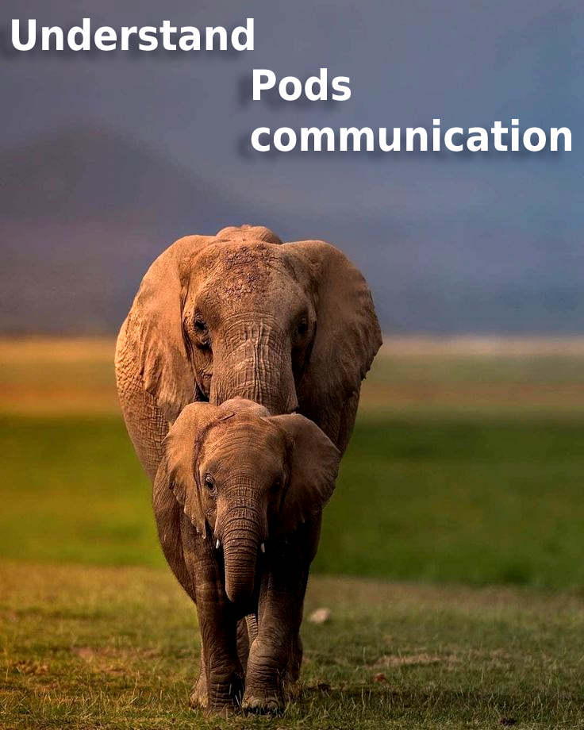
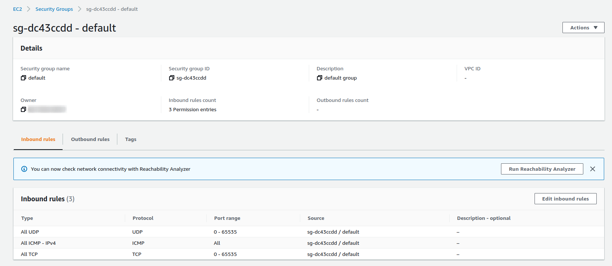

<p align="center">
  <a href="https://dev.to/vumdao">
    
  </a>
</p>
<h1 align="center">
  <div><b>Understand Pods communication</b></div>
</h1>

## Abstract
- When create new Auto scaling group, there were two issues that I faced:
    1. IPAM failed to start (no secondary in the ASG nodes)
    2. Pods were not able to connect public URL although outbound allows all traffic to 0.0.0.0

- Let's figure out why

## Table Of Contents
 * [Security groups for your VPC](#Security-groups-for-your-VPC)
 * [Pod networking (CNI)](#Pod-networking-(CNI))
 * [Understand CoreDNS](#Understand-CoreDNS)
 * [Conclusion](#Conclusion)

---

## 🚀 **Security groups for your VPC** <a name="Security-groups-for-your-VPC"></a>
- [Security groups for your VPC](https://docs.aws.amazon.com/vpc/latest/userguide/VPC_SecurityGroups.html)

- Security groups are stateful — if you send a request from your instance, the response traffic for that request is allowed to flow in regardless of inbound security group rules. Responses to allowed inbound traffic are allowed to flow out, regardless of outbound rules. 

- **Instances** associated with a security group can't talk to each other unless you add rules allowing the traffic (exception: the default security group has these rules by default).



- By default, when you create a network interface, it's associated with the default security group for the VPC, unless you specify a different security group

- Security group rules:
    - Source or destination: The source (inbound rules) or destination (outbound rules) for the traffic. Specify one of these options:
        - Another security group. This allows instances that are associated with the specified security group to access instances associated with this security group. Choosing this option does not add rules from the source security group to this security group. You can specify one of the following security groups:
            - The current security group
            - A different security group for the same VPC
            - A different security group for a peer VPC in a VPC peering connection

- When you specify a security group as the source or destination for a rule, the rule affects all instances that are associated with the security group. Incoming traffic is allowed based on the private IP addresses of the instances that are associated with the source security group (and not the public IP or Elastic IP addresses).

- When you specify a security group as the source for a rule, traffic is allowed from the network interfaces that are associated with the source security group for the specified protocol and port. Incoming traffic is allowed based on the private IP addresses of the network interfaces that are associated with the source security group (and not the public IP or Elastic IP addresses).

## 🚀 **Pod networking (CNI)** <a name="Security-groups-for-your-VPC"></a>
- [Pod networking (CNI)](https://docs.aws.amazon.com/eks/latest/userguide/pod-networking.html)
- Amazon EKS supports native VPC networking with the Amazon VPC Container Network Interface (CNI) plugin for Kubernetes. This plugin assigns an IP address from your VPC to each pod.
- When you create an Amazon EKS node, it has one network interface. All Amazon EC2 instance types support more than one network interface. The network interface attached to the instance when the instance is created is called the primary network interface. Any additional network interface attached to the instance is called a secondary network interface. Each network interface can be assigned multiple private IP addresses. One of the private IP addresses is the primary IP address, whereas all other addresses assigned to the network interface are secondary IP addresses.

- The Amazon VPC Container Network Interface (CNI) plugin for Kubernetes is deployed with each of your Amazon EC2 nodes in a Daemonset with the name aws-node. The plugin consists of two primary components:
    - [L-IPAM](https://github.com/aws/amazon-vpc-cni-k8s/blob/master/docs/cni-proposal.md#local-ip-address-manager-l-ipam) daemon
        - When a worker node first joins the cluster, there is only 1 ENI along with all of its addresses in the ENI. Without any configuration, ipamd always try to keep one extra ENI.
        - L-IPAM is responsible for creating network interfaces and attaching the network interfaces to Amazon EC2 instances, assigning secondary IP addresses to network interfaces, and maintaining a warm pool of IP addresses on each node for assignment to Kubernetes pods when they are scheduled. When the number of pods running on the node exceeds the number of addresses that can be assigned to a single network interface, the plugin starts allocating a new network interface, as long as the maximum number of network interfaces for the instance aren't already attached.
        - L-IPAM requires the IAM policy which is AWS managed policy [AmazonEKS_CNI_Policy](https://console.aws.amazon.com/iam/home#/policies/arn:aws:iam::aws:policy/AmazonEKS_CNI_Policy%24jsonEditor)
        - Each pod that you deploy is assigned one secondary private IP address from one of the network interfaces attached to the instance

    - CNI plugin – Responsible for wiring the host network (for example, configuring the network interfaces and virtual Ethernet pairs) and adding the correct network interface to the pod namespace.


- Check inside a host
```
[root@ip-172-10-12-55 ec2-user]# ip route show
default via 172.10.12.1 dev eth0 
169.254.169.254 dev eth0 
172.10.12.0/24 dev eth0 proto kernel scope link src 172.10.12.55 
172.10.12.17 dev enib6ba4ad7e6d scope link 
172.10.12.175 dev eni65cfa2c6d07 scope link 
172.10.12.227 dev enib1effc0b0ce scope link 
172.10.12.247 dev eni7b8c0d17d54 scope link 
```

- Starting IPAM daemon
    - IPAM failed to start
        ```
        root@ctl:/var/snap/amazon-ssm-agent/4047# kubectl logs -f -n kube-system aws-node-m9jg6
        Copying portmap binary ... Starting IPAM daemon in the background ... ok.
        Checking for IPAM connectivity ...  failed.
        Timed out waiting for IPAM daemon to start:
        ```

    - IPAM started successfully
        ```
        root@ctl:/var/snap/amazon-ssm-agent/4047# kf logs -n kube-system aws-node-x2dh4
        {"level":"info","ts":"2021-10-12T17:00:51.749Z","caller":"entrypoint.sh","msg":"Install CNI binary.."}
        {"level":"info","ts":"2021-10-12T17:00:51.772Z","caller":"entrypoint.sh","msg":"Starting IPAM daemon in the background ... "}
        {"level":"info","ts":"2021-10-12T17:00:51.773Z","caller":"entrypoint.sh","msg":"Checking for IPAM connectivity ... "}
        {"level":"info","ts":"2021-10-12T17:00:53.814Z","caller":"entrypoint.sh","msg":"Copying config file ... "}
        {"level":"info","ts":"2021-10-12T17:00:53.819Z","caller":"entrypoint.sh","msg":"Successfully copied CNI plugin binary and config file."}
        {"level":"info","ts":"2021-10-12T17:00:53.823Z","caller":"entrypoint.sh","msg":"Foregrounding IPAM daemon ..."}
        ```

- Inter-process communication between CNI-plugin and L-IPAM


## 🚀 **Understand CoreDNS** <a name="Understand-CoreDNS"></a>
- [CoreDNS](https://coredns.io/) is a flexible, extensible DNS server that can serve as the Kubernetes cluster DNS.
- In large scale Kubernetes clusters, CoreDNS’s memory usage is predominantly affected by the number of Pods and Services in the cluster. Other factors include the size of the filled DNS answer cache, and the rate of queries received (QPS) per CoreDNS instance.
- There are two different ports: 5300 and 53. Internally, each of these ports will result in a dnsserver.Server


- Create pod to test coredns
    <details>
    <summary>dnsutil.yaml</summary>

    ```
    apiVersion: v1
    kind: Pod
    metadata:
    name: dnsutils
    namespace: airflow
    spec:
    containers:
    - name: dnsutils
        image: gcr.io/kubernetes-e2e-test-images/dnsutils:1.3
        command:
        - sleep
        - "3600"
        imagePullPolicy: IfNotPresent
    restartPolicy: Always
    affinity:
        nodeAffinity:
            requiredDuringSchedulingIgnoredDuringExecution:
            nodeSelectorTerms:
                - matchExpressions:
                - key: type
                    operator: In
                    values:
                    - airflow-stateless
    tolerations:
        - key: 'dedicated'
            operator: 'Equal'
            value: 'airflow'
            effect: 'NoSchedule'
    ```

    </details>

    - Access pod and run host
        ```
        root@ctl:/tmp/airflow# kf exec -it dnsutils -- sh
        / # # Before allow traffic of this node to other ones (especially the ones host coredns pod) 
        / # host airflow-web
        ;; connection timed out; no servers could be reached

        /# # After allow traffic
        / # host airflow-web
        airflow-web.airflow.svc.cluster.local has address 172.20.21.163
        ```
    
    - Further failed to resolve DNS if the pod is not allowed traffic to coredns
        ```
        root@us-vc-p1-ctl:/tmp/airflow# kf logs -f airflow-scheduler-858854c8b8-6vdb4 dags-git-clone
        INFO: detected pid 1, running init handler
        I1013 17:30:23.795367      13 main.go:430]  "level"=0 "msg"="starting up"  "args"=["/git-sync"] "pid"=13
        I1013 17:30:23.795483      13 main.go:694]  "level"=0 "msg"="cloning repo"  "origin"="https://gitlab.cloudopz.co/airflow.git" "path"="/dags"
        E1013 17:30:43.866130      13 main.go:455]  "msg"="too many failures, aborting" "error"="Run(git clone --no-checkout -b us-master --depth 1 https://gitlab.cloudopz.co/airflow.git /dags): exit status 128:
        { stdout: \"\", stderr: \"Cloning into '/dags'...\\nfatal: unable to access 'https://gitlab.cloudopz.co/airflow.git/': Could not resolve host: gitlab.cloudopz.co\\n\" }"  "failCount"=0
        ```

- ASG1
    - SG1
        - Allow all traffic from ENI of SG1 (Pod communitcation between nodes of the ASG1)
        - Allow all traffic from ENI of SG2 (Pod communitcation between nodes of the ASG2 to Pods of nodes from ASG1)

- ASG2
    - SG2:
        - Allow all traffic from ENI of SG1 (Pod communitcation between nodes of the ASG2)
        - Allow all traffic from ENI of SG2 (Pod communitcation between nodes of the ASG1 to Pods of nodes from ASG2)

## 🚀 **Conclusion** <a name="Conclusion"></a>
- In general, solution from the two original issues  are:
    1. IAM Worker role need permission to create ENI, assign IP addresses
    2. Pod between nodes between autoscaling groups need to allow traffics in their network interfaces which are assigned to ASG SGs